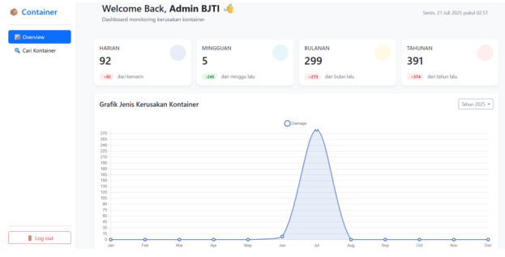

# 📦 Container Damage Detection System

## 🚢 Overview

Container Damage Detection System adalah sistem berbasis Artificial Intelligence yang dirancang untuk melakukan inspeksi kontainer secara otomatis di area gate pelabuhan.

Sistem ini mampu:
- Mendeteksi kerusakan pada kontainer
- Membaca nomor kontainer secara otomatis (OCR)
- Mengintegrasikan hasil deteksi ke sistem backend melalui API
- Membantu proses monitoring dan pencatatan kerusakan secara real-time

Proyek ini dikembangkan sebagai Final Project pada bidang Computer Vision dan Deep Learning.

---

## 🎯 Project Goals

- Mengotomatisasi proses inspeksi kontainer
- Mengurangi human error dalam pencatatan kerusakan
- Mempercepat proses identifikasi kontainer di gate
- Mengintegrasikan deteksi visual dan sistem informasi dalam satu alur kerja

---

## 🧠 Key Features

✅ Automatic container detection  
✅ Damage detection using Deep Learning  
✅ Container number recognition (OCR)  
✅ API integration with web system  

---

## 🏗 System Architecture (High-Level)

1. Image input from gate monitoring
2. Container validation
3. Damage detection using YOLO
4. Container number recognition (OCR pipeline)
5. Data upload to backend system
6. Storage and monitoring via web dashboard

---

## 🛠 Technologies Used

- Python
- YOLO (Object Detection)
- TensorFlow / Keras
- OpenCV
- REST API Integration
- Web Backend Integration

---

## 📊 Output Example

- Annotated container image
- Detected damage type
- Container number
- Timestamp
- Gate location
- Data stored in backend system

---

## 💡 Impact

Sistem ini menunjukkan bagaimana teknologi Computer Vision dapat diterapkan pada lingkungan industri (terminal peti kemas) untuk:

- Meningkatkan efisiensi operasional
- Mendukung digitalisasi proses inspeksi
- Mengurangi ketergantungan pada inspeksi manual

